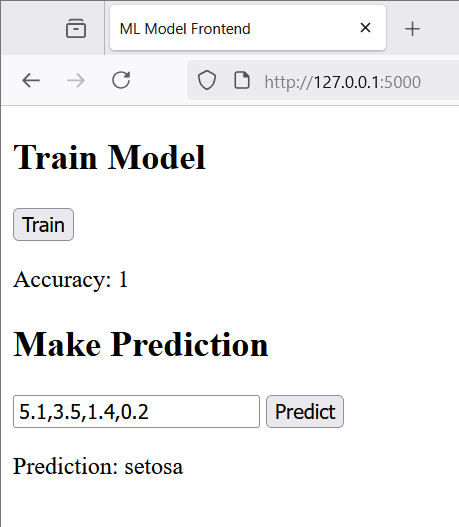

# RandomForestClassifier
RandomForestClassifier : CSV Load, Train, Infer Model Demo # sklearn.ensemble # train_test_split # accuracy_score

## Objective
- load csv format dataset
- train the model on the dataset
- inference the predictions of the trained mode

## CSV Load, Train, Infer RandomForestClassifier Model Demo

